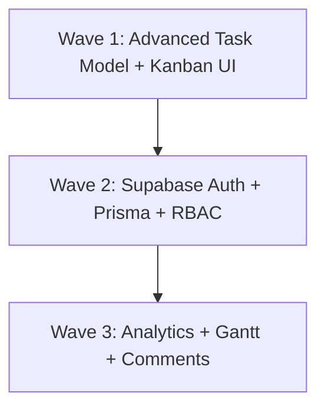

# Simple Project Task Tracker 2.0 — Development Plan

**Version:** 2.0  
**Status:** North Star blueprint (pre-implementation)  
**Predecessor:** [Simple Project Task Tracker](../Simple%20Project%20Task%20Tracker) (v1.0 MVP — LocalStorage, single-user)  
**Stack (target):** Next.js (App Router), TypeScript, Tailwind CSS, PostgreSQL, Prisma, Supabase Auth  
**Audience:** Human engineers and AI collaborators delivering Version 2.0  
**Language:** Australian English  

---

## 1. Project Overview

Version 2.0 advances the existing **Simple Project Task Tracker** from a single-user, LocalStorage-based MVP into an enterprise-grade, multi-user application. The upgraded tracker retains and expands every core capability from Version 1.0—project and task CRUD, status workflow, overdue awareness, and defensive error handling—while adding interactive Kanban boards, Microsoft Planner–style task details (buckets, priorities, multi-date tracking, checklists, and comments), interactive Gantt charts, and progress analytics. Persistence moves from the browser to PostgreSQL (via Prisma), with identity and Role-Based Access Control delivered through Supabase Auth, so teams can collaborate securely across projects with clear privileges for Super PM, PM, Member, and Viewer roles.

---

## 2. Feature List (Version 2.0 Scope)

Each item below is a discrete, buildable unit with a unique ID. Treat each as a ticket that can be completed and demoed independently. All Version 1.0 behaviours (project/task CRUD, status workflow, empty states, validation, responsive layout) are assumed as the baseline and are expanded by these features.

### F-201: Interactive Drag-and-Drop Kanban Board

| Aspect | Detail |
|--------|--------|
| **Columns** | `To Do` · `Doing` / `In Progress` · `Completed` / `Done` |
| **Behaviour** | Drag tasks between columns; drop updates `Task.status` immediately (optimistic UI with rollback on failure) |
| **Card content** | Title, priority indicator, assignee/PIC, planned due date, overdue styling |
| **Carry-over from v1** | Status values remain aligned with `todo` → `in_progress` → `done`; list/filter views may coexist as alternate presentations of the same data |

### F-202: MS Planner–Style Task Details

| Aspect | Detail |
|--------|--------|
| **Buckets / Groups** | Project-phase buckets: Initiating · Planning · Executing · Monitoring · Closing |
| **Priority** | Explicit levels (e.g. Urgent · Important · Medium · Low) |
| **Multi-date tracking** | Planned start/due, updated start/due, and actual start/completion dates |
| **Sub-task checklists** | Nested checklist items with completion toggles (`Subtask`) |
| **Task comments / chat** | Threaded comments on a task (`TaskComment`) for asynchronous collaboration |
| **UI pattern** | Side panel or detail drawer opened from Kanban card, Gantt bar, or task list row |

### F-203: Multi-User Authentication & Granular RBAC

| Aspect | Detail |
|--------|--------|
| **Provider** | Supabase Auth (email/password and/or OAuth as configured) |
| **Roles** | Super PM (Admin) · PM · Member · Viewer |
| **Scope** | Global role on `User`, plus per-project membership via `Project.permittedUserIds` (and/or a join table equivalent) |
| **Carry-over from v1** | Replaces the implicit single-owner model; every mutation is authenticated and authorised |

### F-204: Interactive Gantt Chart View

| Aspect | Detail |
|--------|--------|
| **Timeline** | Bars mapped by planned/updated/actual duration and dates |
| **Grouping** | Rows by task, optionally grouped by Assignee/PIC or bucket |
| **Interaction** | View and (where permitted) adjust date ranges; hover/click opens task details |
| **Integrity** | Invalid or inverted date ranges must not crash the chart (see Section 6) |

### F-205: Project Progress Dashboard & Analytics

| Aspect | Detail |
|--------|--------|
| **Status distribution** | Widgets/charts for To Do / Doing / Done counts and proportions |
| **Overdue tracking** | Tasks past planned/updated due date and not completed |
| **Workload per PIC** | Task load and completion metrics by assignee |
| **Scope** | Per-project dashboard; Super PM may later aggregate across projects |

### F-206: Local Domain Configuration (`tracker.local`)

| Aspect | Detail |
|--------|--------|
| **Goal** | Serve the app locally under `http://tracker.local` (or `https://tracker.local` if TLS is configured) |
| **Typical setup** | Hosts file entry + local reverse proxy / Next.js `hostname` config as documented in tech notes |
| **Purpose** | Stable local URL for cookies, auth redirects, and team demos without relying solely on `localhost` |

### Explicit carry-forward from Version 1.0 (baseline, not re-numbered)

- Project list, create, edit, delete (with cascade to tasks)
- Task create, edit, delete within a project
- Empty states, form validation, responsive layout
- Overdue visual treatment for incomplete past-due tasks
- Graceful recovery patterns (adapted from LocalStorage corruption/quota handling to network and auth failures)

---

## 3. Data Models

All primary keys are **UUID** strings. Timestamps are stored as timestamptz in PostgreSQL and exposed as ISO 8601 strings in TypeScript. The schemas below are the canonical Version 2.0 domain; Prisma models and TypeScript interfaces should stay aligned.

### 3.1 Enums

```typescript
type GlobalRole = 'super_pm' | 'pm' | 'member' | 'viewer';

type TaskStatus = 'todo' | 'in_progress' | 'done';

type TaskPriority = 'urgent' | 'important' | 'medium' | 'low';

type TaskBucket =
  | 'initiating'
  | 'planning'
  | 'executing'
  | 'monitoring'
  | 'closing';
```

### 3.2 User

| Field | Type | Required | Notes |
|-------|------|----------|-------|
| `id` | `string` (UUID) | yes | Matches Supabase Auth `auth.users.id` |
| `email` | `string` | yes | Unique |
| `name` | `string` | yes | Display name |
| `globalRole` | `GlobalRole` | yes | Super PM / PM / Member / Viewer |
| `createdAt` | `DateTime` | yes | |
| `updatedAt` | `DateTime` | yes | |

```typescript
interface User {
  id: string;
  email: string;
  name: string;
  globalRole: GlobalRole;
  createdAt: string;
  updatedAt: string;
}
```

### 3.3 Project

| Field | Type | Required | Notes |
|-------|------|----------|-------|
| `id` | `string` (UUID) | yes | |
| `name` | `string` | yes | 1–100 chars (v1 constraint retained) |
| `description` | `string` | no | 0–500 chars |
| `ownerId` | `string` (UUID) | yes | FK → `User.id` (creator / owning PM) |
| `permittedUserIds` | `string[]` (UUID) | yes | Users explicitly granted access (Members, Viewers, collaborating PMs) |
| `createdAt` | `DateTime` | yes | |
| `updatedAt` | `DateTime` | yes | Bumped on project or nested task changes |

```typescript
interface Project {
  id: string;
  name: string;
  description: string;
  ownerId: string;
  permittedUserIds: string[];
  createdAt: string;
  updatedAt: string;
}
```

> **Implementation note:** Prefer a `ProjectMember` join table (`projectId`, `userId`, `projectRole?`) in Prisma for referential integrity; expose `permittedUserIds` as a derived or convenience field in the application layer if needed.

### 3.4 Task

| Field | Type | Required | Notes |
|-------|------|----------|-------|
| `id` | `string` (UUID) | yes | |
| `projectId` | `string` (UUID) | yes | FK → `Project.id` |
| `title` | `string` | yes | 1–200 chars |
| `description` | `string` | no | 0–1000+ chars |
| `status` | `TaskStatus` | yes | Default `todo`; drives Kanban column |
| `priority` | `TaskPriority` | yes | Default `medium` |
| `bucket` | `TaskBucket` | yes | Planner-style group; default `executing` or project-configurable |
| `assigneeId` | `string` (UUID) \| `null` | no | FK → `User.id` (PIC) |
| `plannedStartDate` | `Date` \| `null` | no | |
| `plannedDueDate` | `Date` \| `null` | no | Replaces/extends v1 single `dueDate` |
| `updatedStartDate` | `Date` \| `null` | no | Forecast revision |
| `updatedDueDate` | `Date` \| `null` | no | Forecast revision |
| `actualStartDate` | `Date` \| `null` | no | |
| `actualCompletionDate` | `Date` \| `null` | no | Typically set when status → `done` |
| `createdAt` | `DateTime` | yes | |
| `updatedAt` | `DateTime` | yes | |

```typescript
interface Task {
  id: string;
  projectId: string;
  title: string;
  description: string;
  status: TaskStatus;
  priority: TaskPriority;
  bucket: TaskBucket;
  assigneeId: string | null;
  plannedStartDate: string | null;
  plannedDueDate: string | null;
  updatedStartDate: string | null;
  updatedDueDate: string | null;
  actualStartDate: string | null;
  actualCompletionDate: string | null;
  createdAt: string;
  updatedAt: string;
}
```

### 3.5 Subtask / Checklist

| Field | Type | Required | Notes |
|-------|------|----------|-------|
| `id` | `string` (UUID) | yes | |
| `taskId` | `string` (UUID) | yes | FK → `Task.id` |
| `title` | `string` | yes | |
| `isCompleted` | `boolean` | yes | Default `false` |
| `sortOrder` | `number` | recommended | Stable checklist order |
| `createdAt` | `DateTime` | yes | |
| `updatedAt` | `DateTime` | yes | |

```typescript
interface Subtask {
  id: string;
  taskId: string;
  title: string;
  isCompleted: boolean;
  createdAt?: string;
  updatedAt?: string;
}
```

### 3.6 TaskComment

| Field | Type | Required | Notes |
|-------|------|----------|-------|
| `id` | `string` (UUID) | yes | |
| `taskId` | `string` (UUID) | yes | FK → `Task.id` |
| `userId` | `string` (UUID) | yes | FK → `User.id` |
| `content` | `string` | yes | Plain text; sanitise on render |
| `createdAt` | `DateTime` | yes | |

```typescript
interface TaskComment {
  id: string;
  taskId: string;
  userId: string;
  content: string;
  createdAt: string;
}
```

### 3.7 Relationships

```text
User 1 ──< Project (ownerId)
User * ──< Project (permittedUserIds / ProjectMember)
Project 1 ──< Task many
User 1 ──< Task (assigneeId) many
Task 1 ──< Subtask many
Task 1 ──< TaskComment many
User 1 ──< TaskComment many
```

### 3.8 Derived data (not persisted)

- `taskCountByStatus(projectId)`
- `isOverdue(task)` — effective due date in the past and `status !== 'done'`
- `effectiveStartDate` / `effectiveDueDate` — prefer updated dates when present, else planned
- `checklistProgress(taskId)` — completed / total subtasks
- Analytics aggregates for F-205 (status distribution, overdue count, workload by `assigneeId`)

### 3.9 Prisma sketch (illustrative)

```prisma
enum GlobalRole {
  super_pm
  pm
  member
  viewer
}

enum TaskStatus {
  todo
  in_progress
  done
}

enum TaskPriority {
  urgent
  important
  medium
  low
}

enum TaskBucket {
  initiating
  planning
  executing
  monitoring
  closing
}

model User {
  id         String     @id @db.Uuid
  email      String     @unique
  name       String
  globalRole GlobalRole
  createdAt  DateTime   @default(now())
  updatedAt  DateTime   @updatedAt
  ownedProjects Project[] @relation("ProjectOwner")
  // ... memberships, assignedTasks, comments
}

model Project {
  id          String   @id @default(uuid()) @db.Uuid
  name        String
  description String   @default("")
  ownerId     String   @db.Uuid
  owner       User     @relation("ProjectOwner", fields: [ownerId], references: [id])
  createdAt   DateTime @default(now())
  updatedAt   DateTime @updatedAt
  tasks       Task[]
  // members via ProjectMember
}

model Task {
  id                   String        @id @default(uuid()) @db.Uuid
  projectId            String        @db.Uuid
  title                String
  description          String        @default("")
  status               TaskStatus    @default(todo)
  priority             TaskPriority  @default(medium)
  bucket               TaskBucket    @default(executing)
  assigneeId           String?       @db.Uuid
  plannedStartDate     DateTime?     @db.Date
  plannedDueDate       DateTime?     @db.Date
  updatedStartDate     DateTime?     @db.Date
  updatedDueDate       DateTime?     @db.Date
  actualStartDate      DateTime?     @db.Date
  actualCompletionDate DateTime?     @db.Date
  createdAt            DateTime      @default(now())
  updatedAt            DateTime      @updatedAt
  project              Project       @relation(fields: [projectId], references: [id], onDelete: Cascade)
  subtasks             Subtask[]
  comments             TaskComment[]
}

model Subtask {
  id          String   @id @default(uuid()) @db.Uuid
  taskId      String   @db.Uuid
  title       String
  isCompleted Boolean  @default(false)
  task        Task     @relation(fields: [taskId], references: [id], onDelete: Cascade)
}

model TaskComment {
  id        String   @id @default(uuid()) @db.Uuid
  taskId    String   @db.Uuid
  userId    String   @db.Uuid
  content   String
  createdAt DateTime @default(now())
  task      Task     @relation(fields: [taskId], references: [id], onDelete: Cascade)
}
```

---

## 4. API Surface & Data Access

Version 2.0 replaces the LocalStorage service module with authenticated **Next.js Server Actions** and/or **Route Handlers**, backed by Prisma against PostgreSQL, with Supabase session verification on every privileged call. Keep a thin repository boundary so UI hooks call stable function names regardless of transport.

### 4.1 Auth operations

| Operation | Mechanism | Notes |
|-----------|-----------|-------|
| Login | Supabase Auth `signInWithPassword` / OAuth | Establish session cookie / JWT |
| Logout | Supabase Auth `signOut` | Clear session; redirect to login |
| Session check | Middleware + `getSession` / `getUser` | Protect app routes; expose current user + `globalRole` |
| RBAC verification | Server-side helper `assertPermission(user, action, resource)` | Never trust client-only role checks |
| Profile bootstrap | On first login, upsert `User` row from Auth identity | Ensure `globalRole` defaults safely (e.g. `viewer` until elevated) |

Suggested surfaces:

- `POST` login / logout (or Supabase client helpers from a Server Action)
- `GET` current session / me
- Middleware: redirect unauthenticated users away from `/projects`, `/dashboard`, etc.

### 4.2 Project CRUD (with access-control checks)

| Operation | Authorised roles (summary) | Notes |
|-----------|----------------------------|-------|
| List projects | Authenticated; filtered by visibility rules | Super PM: all; others: owned + permitted |
| Get project by id | Must have project access | 404 if missing; 403 if no access |
| Create project | Super PM, PM | Sets `ownerId` to creator |
| Update project | Super PM; owning PM | Name, description, membership list |
| Delete project | Super PM; owning PM | Cascade delete tasks, subtasks, comments |
| Grant / revoke access | Super PM; owning PM | Mutate `permittedUserIds` / `ProjectMember` |

### 4.3 Task CRUD & Kanban state updates

| Operation | Notes |
|-----------|-------|
| List tasks by project | Requires project access |
| Get task by id | Requires project access |
| Create task | Member+ on assigned projects; PM/Super PM per Section 5 |
| Update task fields | Title, description, priority, bucket, assignee, dates |
| Update task status (Kanban DnD) | Dedicated mutation for drag-and-drop; validate status enum; optional auto-set `actualStartDate` / `actualCompletionDate` |
| Delete task | Per RBAC; cascade subtasks and comments |

### 4.4 Checklist and comment mutations

| Operation | Notes |
|-----------|-------|
| Add / update / delete / reorder subtasks | Write roles only |
| Toggle `isCompleted` | Members may check off items on permitted projects |
| List comments for task | Read roles with project access |
| Create comment | Member+ (not Viewer) |
| Delete own comment | Author; Super PM may delete any; optional PM policy |

### 4.5 Analytics aggregation queries

| Query | Output |
|-------|--------|
| Status distribution | Counts / percentages by `TaskStatus` for a project |
| Overdue tasks | Incomplete tasks past effective due date |
| Workload by PIC | Group by `assigneeId` (open vs done, overdue) |
| Optional timeline health | Planned vs actual date variance for Gantt/dashboard |

Prefer server-side aggregation (SQL/`groupBy`) over shipping full task lists solely for charts when datasets grow.

### 4.6 Error contract

Reuse the Version 1.0 error mindset with HTTP/app equivalents:

| Error | When |
|-------|------|
| `UnauthorisedError` | No session |
| `ForbiddenError` | Session present but RBAC denies action |
| `NotFoundError` | Missing project/task |
| `ValidationError` | Invalid fields, dates, or status |
| `ConflictError` | Optimistic concurrency / stale Kanban update (if implemented) |

---

## 5. Authentication & Authorization Requirements

### 5.1 Authentication (Supabase Auth)

1. Users authenticate via **Supabase Auth**.
2. Application middleware validates the session on protected routes.
3. A corresponding `User` profile row stores `email`, `name`, and `globalRole`.
4. All Server Actions / API handlers resolve the current user before mutating data.
5. Local development may use `tracker.local` as the site URL / redirect base (F-206) so auth cookies behave consistently.

### 5.2 Role-Based Access Control (RBAC)

Privileges are evaluated as **global role** combined with **project ownership / permitted membership**.

#### Super PM (Admin)

- Full CRUD across **all** projects and tasks.
- May create, view, edit, or delete their own projects/tasks **and** those created by others.
- May grant Viewer (or other) access to specific projects or all projects.
- May elevate or change other users’ `globalRole` (admin-only settings surface).

#### PM (Project Manager)

- Full CRUD **strictly on projects they have created** (`ownerId === currentUser.id`).
- **Read-only** access to projects owned by others (when those projects are visible—e.g. listed for organisational awareness—or explicitly permitted; default recommendation: PMs see others’ projects as read-only only if Super PM grants visibility).
- May manage membership (`permittedUserIds`) on projects they own.
- May not delete or permanently alter another PM’s owned projects.

#### Member

- Access **only** to projects to which they are explicitly assigned (`permittedUserIds` / membership).
- **No access** to unassigned projects (not listed; direct URL returns 403/404 as designed).
- Within assigned projects: create and edit tasks, move task statuses on the Kanban board, check off checklist items, and post comments.
- May not delete the project itself; task deletion policy: allowed for tasks they created or as configured by PM (document default: Members can delete tasks they created; PMs/Super PMs can delete any task in scope).

#### Viewer

- **Read-only** access to Kanban, Gantt, task details, and analytics.
- Restricted strictly to projects Super PM (or owning PM) has permitted.
- Cannot create/edit/delete tasks, move Kanban cards, toggle checklists, or post comments.

### 5.3 Permission matrix (summary)

| Action | Super PM | PM (own) | PM (others) | Member (assigned) | Viewer (permitted) |
|--------|----------|----------|-------------|-------------------|--------------------|
| View project / Kanban / Gantt / analytics | ✓ | ✓ | Read-only* | ✓ | ✓ |
| Create / edit / delete project | ✓ | ✓ | ✗ | ✗ | ✗ |
| Manage project membership | ✓ | ✓ | ✗ | ✗ | ✗ |
| Create / edit tasks | ✓ | ✓ | ✗ | ✓ | ✗ |
| Kanban status move | ✓ | ✓ | ✗ | ✓ | ✗ |
| Checklist toggle | ✓ | ✓ | ✗ | ✓ | ✗ |
| Post comments | ✓ | ✓ | ✗ | ✓ | ✗ |
| Delete any task in scope | ✓ | ✓ | ✗ | Limited† | ✗ |

\* Read-only when visibility is granted per product rules.  
† Default: own tasks only, unless PM policy widens this.

### 5.4 Enforcement rules

- **Server is source of truth** — UI may hide buttons, but every mutation re-checks RBAC.
- **Fail closed** — if role or membership is ambiguous, deny.
- **Audit-friendly** — prefer explicit `ForbiddenError` messages that do not leak existence of forbidden resources when appropriate (optional hard-hide via 404).

---

## 6. Edge Cases & Constraints

### 6.1 Explicitly out of scope (Version 2.0)

| Item | Reason |
|------|--------|
| Real-time WebSocket messaging / live cursor presence | Complexity; comments are request/response (refresh or soft revalidate) |
| Automated email / push notifications | Deferred; no notification service in v2.0 |
| File attachments / document store | Storage and scanning overhead |
| Mobile native apps | Web-responsive only |
| Full offline PWA sync | Cloud-backed; graceful offline messaging only |
| Recurring tasks / dependencies (FS/SS links) | Domain complexity beyond Gantt bars |
| Billing, tenants, SSO enterprise IdP beyond Supabase config | Not required for this iteration |
| Automated migration of every LocalStorage v1 browser store | Optional import tool may be considered later; not a launch blocker |

### 6.2 Error states to handle gracefully

| Scenario | Expected behaviour |
|----------|-------------------|
| Unauthorised role access | Deny mutation; show clear toast/banner; redirect Viewers away from edit routes |
| No session / expired session | Redirect to login; preserve return URL where safe |
| Corrupt or inverted dates on Gantt | Skip or clamp invalid bars; show warning on task detail; never crash the chart |
| Network disconnect / timeout | Optimistic Kanban rollback; offline banner; retry-safe actions |
| Project / task not found | Dedicated empty/404 UI with navigation home |
| Delete project with many tasks | Single transactional cascade |
| Assignee removed from project | Keep historical `assigneeId` or null out with warning; prevent new assigns to non-members |
| Concurrent Kanban moves | Last-write-wins or version check; UI refreshes to server state |
| Supabase / DB unavailable | Friendly error page; no partial silent failure on writes |
| Viewer attempts POST via crafted request | Server returns 403 |

### 6.3 Technical constraints

- **Next.js App Router** with Server Components by default; interactive Kanban/Gantt as client components.
- **PostgreSQL + Prisma** for persistence; no LocalStorage as system of record.
- **Supabase Auth** for identity; secrets only in environment variables.
- **Local domain** `tracker.local` (F-206) documented for hosts/proxy setup.
- **Australian English** in user-facing copy.
- **Accessibility:** keyboard alternatives for essential Kanban actions where drag-and-drop is primary.
- **Browser support:** latest Chrome, Firefox, Safari.

### 6.4 Data integrity rules

1. Bump `updatedAt` on every entity mutation; bump parent `Project.updatedAt` when tasks change.
2. Deleting a project cascades tasks, subtasks, and comments.
3. No orphan tasks (`projectId` must exist).
4. Effective dates for Gantt/analytics: prefer updated dates when set, else planned.
5. When status becomes `done`, set `actualCompletionDate` if empty; when leaving `done`, clear or retain per documented policy (default: retain until manually cleared).

---

## 7. Implementation Order (Phased Wave Roadmap)

Build in three waves so each ends with a demoable increment. Version 1.0 capabilities are re-established early, then extended.

### Wave 1 — Advanced Task Model & Drag-and-Drop Kanban Board (Client UI First)

**Focus:** Prove the Version 2.0 task experience in the UI before cloud auth complexity.

**Deliver:**

- Expand domain types for priority, bucket, multi-dates, assignee placeholder, subtasks
- Project detail: interactive Kanban (F-201) with drag-and-drop between To Do / Doing / Done
- Task detail drawer with Planner-style fields (F-202 minus live multi-user comments if backend not ready—use local/mock persistence if needed)
- Carry forward v1 project/task CRUD UX patterns into the new board-centric layout
- Responsive empty states and validation

**Exit criteria:** A user can create a project, manage rich tasks on a Kanban board, edit Planner-style details and checklists, and refresh without losing data (temporary store acceptable if Wave 2 immediately follows).

**Depends on:** Scaffolded Next.js 2.0 app (already present).

---

### Wave 2 — Cloud Backend, Supabase Auth & Multi-User Integration (RBAC Setup)

**Focus:** Replace client-only persistence with PostgreSQL/Prisma and enforce F-203.

**Deliver:**

- Prisma schema + migrations for User, Project, Task, Subtask, TaskComment
- Supabase Auth (login, logout, session middleware)
- Server Actions / APIs for project and task CRUD with access-control checks
- RBAC matrix implementation (Super PM, PM, Member, Viewer)
- Project membership management (`permittedUserIds` / join table)
- Local domain configuration for `tracker.local` (F-206)
- Migrate Kanban and task detail mutations to authenticated server APIs

**Exit criteria:** Multiple users with different roles can log in; permissions match Section 5; Kanban updates persist in PostgreSQL; unauthorised actions are rejected server-side.

**Depends on:** Wave 1 UI contracts stable enough to wire to real APIs.

---

### Wave 3 — Analytics Dashboard, Gantt Chart & Task Comments

**Focus:** Complete collaboration and insight surfaces (F-204, F-205, remainder of F-202).

**Deliver:**

- Interactive Gantt view by duration, dates, and Assignee/PIC
- Project progress dashboard: status distribution, overdue tracking, workload per PIC
- Task comments/chat persisted via `TaskComment` APIs
- Hardening: corrupt date handling on Gantt, network failure UX, RBAC on analytics and comments
- Polish pass: performance of aggregation queries, loading skeletons, mobile layout

**Exit criteria:** Authenticated users can analyse progress, inspect timelines on Gantt, and collaborate via comments within their permitted projects—completing the Version 2.0 North Star scope.

**Depends on:** Wave 2 auth, data model, and task APIs.

---

### Wave dependency diagram



---

## Appendix A — Suggested routes (Version 2.0)

| Route | Purpose |
|-------|---------|
| `/login` | Supabase Auth sign-in |
| `/` | Project list (visibility-filtered) |
| `/projects/[id]` | Project hub: Kanban (default), tabs for Gantt / Analytics |
| `/projects/[id]/tasks/[taskId]` | Deep link to task details (or open drawer) |
| `/admin/users` | Super PM role & access management (optional) |
| `/about` | Product notes, environment info |

---

## Appendix B — Definition of Done (per feature)

- [ ] Works for the intended roles only (server-enforced)
- [ ] Persisted in PostgreSQL after Wave 2
- [ ] Required validation enforced
- [ ] Empty, loading, and error states considered
- [ ] TypeScript strict — no unjustified `any`
- [ ] Matches established Tailwind / UI patterns in the app
- [ ] Documented in tech notes if it introduces new env or ops steps (`tracker.local`, Supabase keys)

---

## Appendix C — Relationship to Version 1.0

| Version 1.0 | Version 2.0 treatment |
|-------------|----------------------|
| LocalStorage `AppStore` | PostgreSQL via Prisma |
| Implicit single user | Supabase Auth + RBAC |
| Status list / filters | Kanban board (primary) + retained status model |
| Single `dueDate` | Planned / updated / actual date set |
| No priorities, buckets, subtasks, comments | Full Planner-style task details |
| No analytics / Gantt | Dashboard widgets + Gantt timeline |
| `localhost` only | `tracker.local` local domain support |

This document is the fixed North Star for Version 2.0. Implement wave by wave; do not expand scope beyond Sections 2 and 6 without an explicit plan revision.
